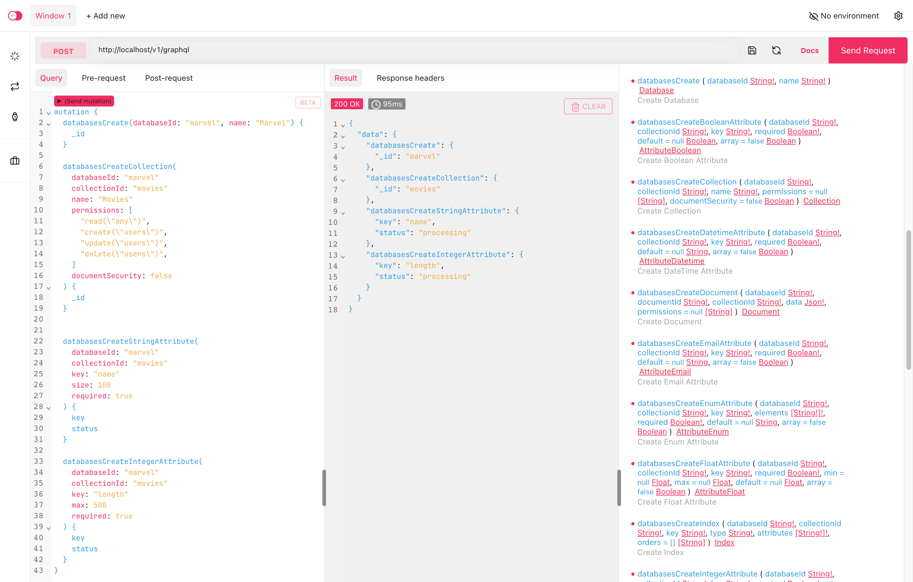

# Docker Altair

[](https://appwrite.io/discord)
[](https://hub.docker.com/r/appwrite/altair)
[](https://travis-ci.com/appwrite/docker-altair)
[](https://twitter.com/appwrite_io)
[](https://stackshare.io/appwrite)

A Docker image for the very popular GraphQL explorer by [Altair](https://altair.sirmuel.design/) 🕸



## Getting Started

These instructions will cover usage information to help your run Altair docker image

### Prerequisities

In order to run this image you'll need docker installed.

- [Windows](https://docs.docker.com/windows/started)
- [OS X](https://docs.docker.com/mac/started/)
- [Linux](https://docs.docker.com/linux/started/)

### Usage

> **Note**
> To ensure the GraphQL docs load in the explorer, set the `_APP_OPTIONS_ABUSE` variable to `disabled` in your `.env` file.

```shell
APPWRITE_ENDPOINT=http://localhost/v1
docker run --rm -p "3000:3000" -e "SERVER_URL=$APPWRITE_ENDPOINT/graphql" appwrite/altair
```

After starting the container, open your browser and browse to [http://localhost:3000/](http://localhost:3000/).

### Environment Variables

This image uses the following Environment Variables

- **SERVER_URL** - Your GraphQL Server URL

### Build / Release

```
docker build --tag appwrite/altair:<TAG> .
docker push appwrite/altair:<TAG>
```

Multi-arch build (experimental using [buildx](https://github.com/docker/buildx)):

```
docker buildx create --use
docker buildx build --platform linux/amd64,linux/arm/v6,linux/arm/v7,linux/arm64,linux/386,linux/ppc64le --tag appwrite/altair:<TAG> --push .
```

## Find Us

- [GitHub](https://github.com/appwrite)
- [Discord](https://appwrite.io/discord)
- [Twitter](https://twitter.com/appwrite_io)

## Copyright and license

The MIT License (MIT) [http://www.opensource.org/licenses/mit-license.php](http://www.opensource.org/licenses/mit-license.php)
